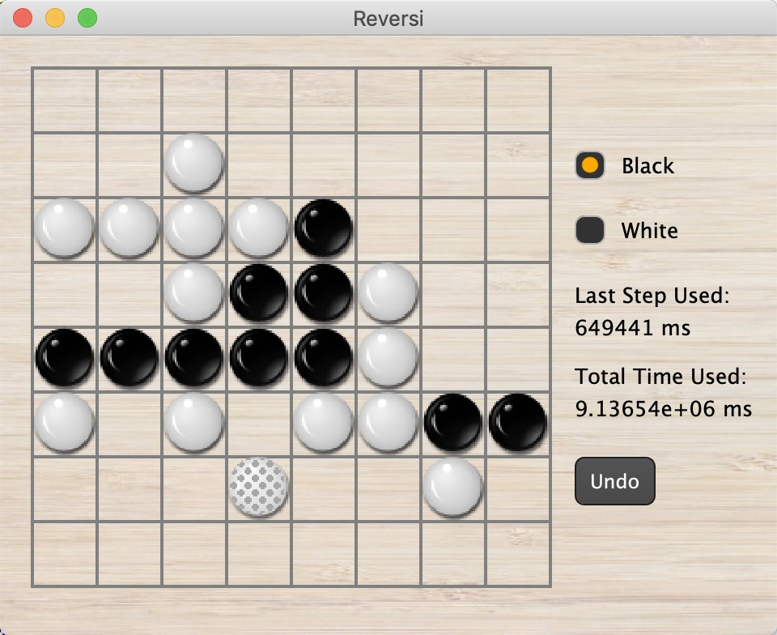

# Reversi-miniAlphaGo
miniAlphaGo for Reversi in MCTS (C++) version and AlphaGo Zero (Pytorch) version. 

## MCTS
<figure >
  
</figure>
UI is made in Qt5.

## AlphaGo Zero
- train: `python train.py`
- play: `python human_play.py`

